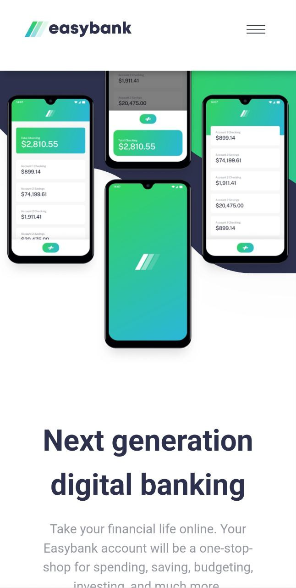
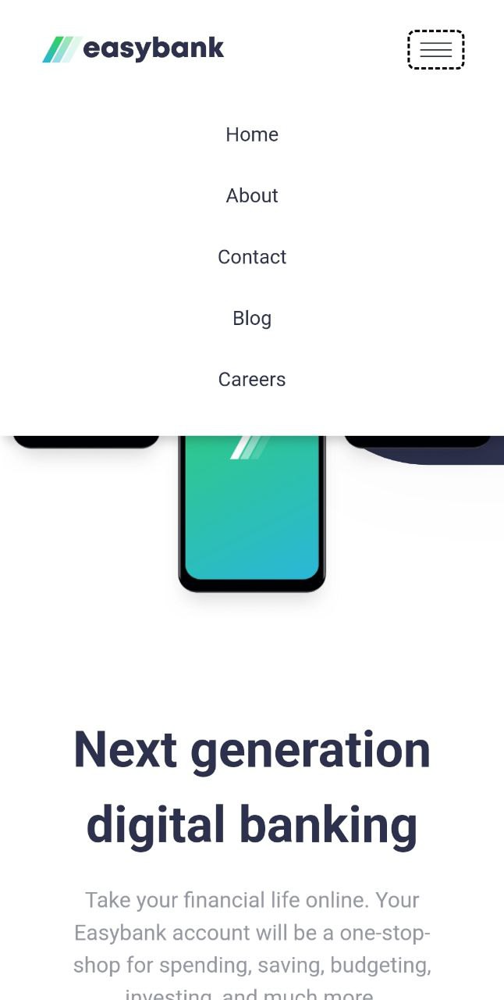
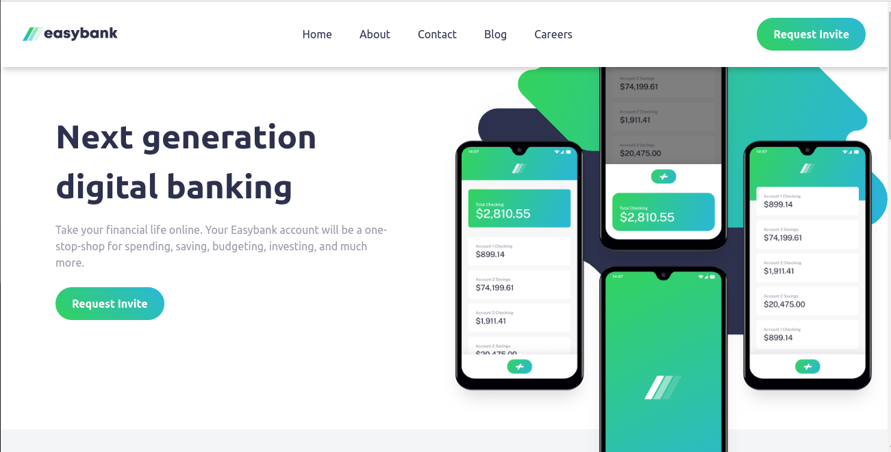

# Easybank Landing Page Solution

This is a solution to the **Easybank Landing Page** challenge from [Frontend Mentor](https://frontendmentor.io)

## Preview

### Default[MOBILE]

### Expanded[MOBILE]

### Desktop

### Built with

- [Visual Studio Code](https://code.visualstudio.com)
- Vite
- SCSS
- JS
- Firefox
- Brave

## Links

- Repository: [Visit](https://github.com/Code-Beaker/easybank-landing-code-beaker)
- Vercel Deploy: [Visit](https://easybank-landing-code-beaker.vercel.app/index.html)
