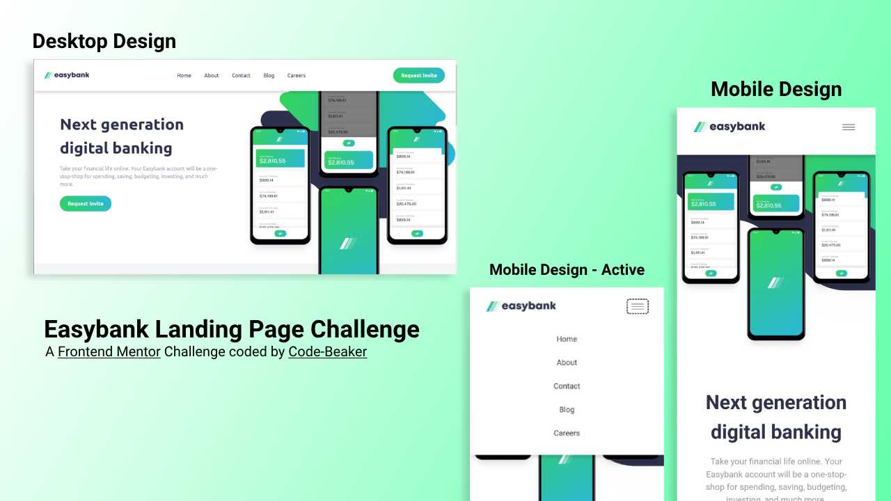

# Easybank Landing Page Solution

This is a solution to the **Easybank Landing Page** challenge from [Frontend Mentor](https://frontendmentor.io)

- [Easybank Landing Page Solution](#easybank-landing-page-solution)
  - [Preview](#preview)
    - [Built with](#built-with)
  - [The process and what I learned](#the-process-and-what-i-learned)
    - [Creating Vite application](#creating-vite-application)
  - [Links](#links)

## Preview



### Built with

- [Visual Studio Code](https://code.visualstudio.com)
- Vite
- SCSS
- JS
- Firefox
- Brave

## The process and what I learned

I have always wanted to build this website when I first explored the Frontend Mentor platform. Now I have successfully made it and even made it interactive. Truly one of the best and most interesting projects.

I have used Vite to bundle all my files for a faster and better coding experience. I used Vanilla HTML with semantic tags along with SCSS and CSS and a few lines of JavaScript.

### Creating Vite application

How I created the Vite application.

```
npm create vite@latest -- --template vanilla app

cd app/

npm install

npm add sass -D
```

This is to initialize and install a new Vite application inside the project foler. It will also install the necessary package to compile SCSS.

```js
import "./scss/style.scss";
import "./typeScales.css";
```

Import the files we want to bundle using Vite inside the JS file.

Then use

```
npm run dev
```

to run a live preview of the website.

## Links

- Repository: [Visit](https://github.com/Code-Beaker/easybank-landing-code-beaker)
- Vercel Deploy: [Visit](https://easybank-landing-code-beaker.vercel.app/index.html)
